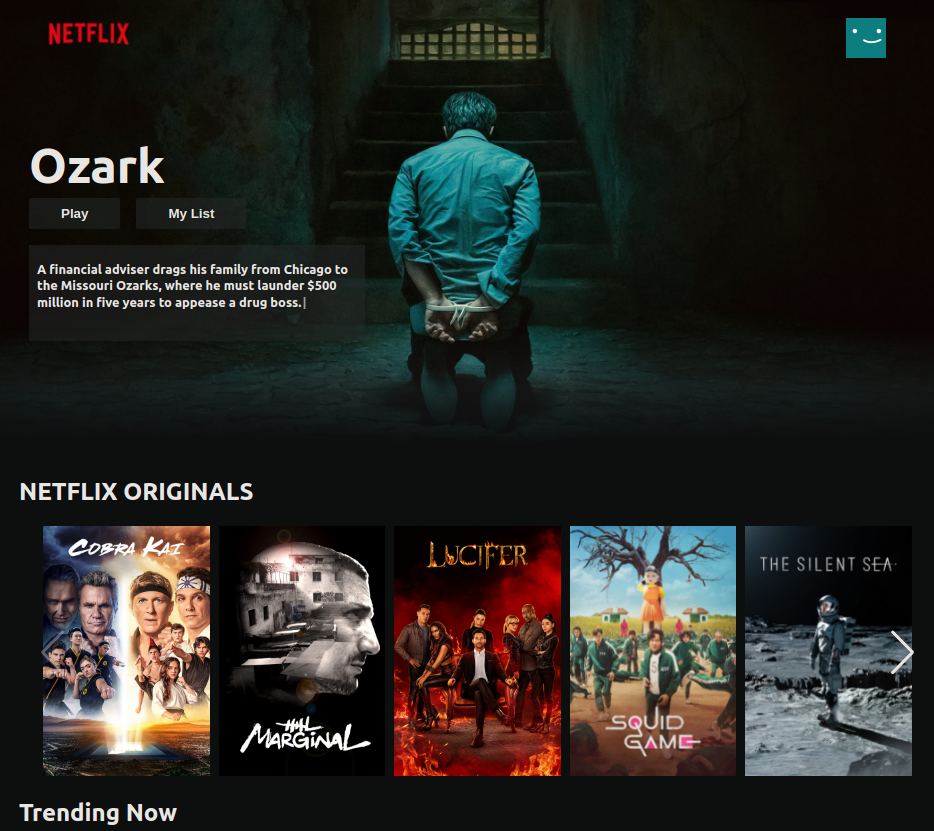
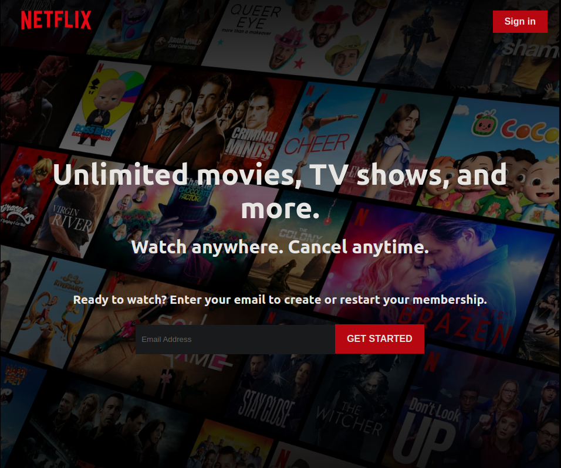
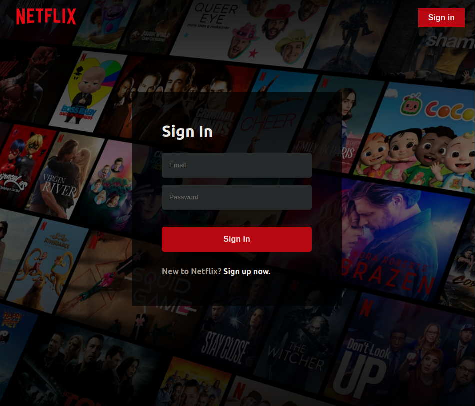
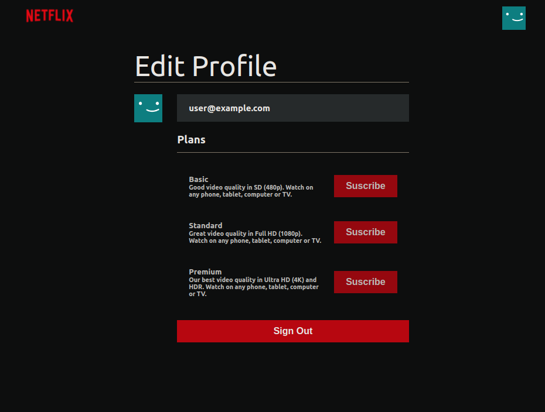
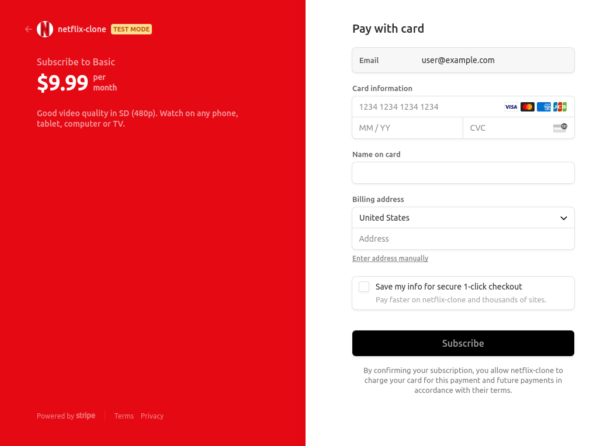

# Netflix Clone

Live Demo: https://netflix-clone-7dcc3.web.app/

As a longtime user of Netflix, I've used their website as inspiration for this full-stack application. This is a personal project for my software developer portfolio, not for commercial purposes.

 

---

## Tech Stack

- Node.js
- Redux
- React
  - Axios
  - React Router
  - Swiper React
  - React-Toastify
  - Typewriter Effect
- Firebase
  - Hosting
  - Firebase Authentication
  - Firestore Database
  - Stripe (Firebase extension)

 

---

## Implementation Highlights

- This project was bootstrapped with Create React App, using the Redux and Redux Toolkit template.

- Movie details are pulled from TMDB using their [API](https://developers.themoviedb.org/3/getting-started/introduction 'TMDB API').

- It features a Sign up and Sign in page that can be tested using the credentials below or entering your own.

  - Email: user@example.com
  - PW: 123456

- Implemented subscription payments with Stripe Checkout. Currently in test mode to show the functionality, no payments are actually made. It can be tested with the details below:

  - Card #: 4242 4242 4242 4242
  - CVC: Any 3 digits
  - Date: Any future date
  - Billing address, enter dummy details

   

---

## Screenshots

 

HomeScreen:

LoginScreen:

SignUpcreen:

ProfileScreen:

Stripe Checkout:

